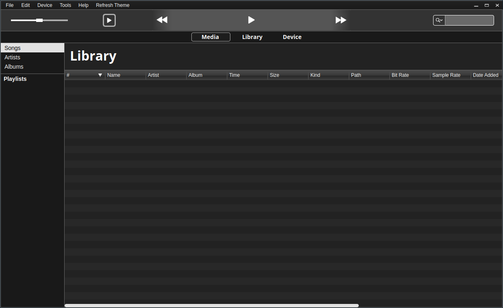

# mpi3

mpi3 is an open source, cross platform C++ project that aims to create a desktop based media player which integrates with a RaspberryPi device for a portable music library and playback experience.

## Getting Started

If you wish to try out the software, there are two convenience scripts provided for building the source.

First, clone the repository and use [configure.sh](./configure.sh) to configure the desired build output and add [qmake](https://doc.qt.io/qt-5/qmake-manual.html) build arguments. 
After configuration, use [build.sh](./build.sh) to build the source.

Alternatively, you can use [Qt Creator](https://www.qt.io/download) to configure the build process providing you add the necessary environment and build variables specified by the project.

## Building

The primary `.pro` file for the project is [build.pro](./src/build.pro).

The project is split into 3 libraries: 
* **libmpi3util**: general API utility classes and functions
* **libmpi3core**: core library and audio output classes
* **libmpi3ui**: either the desktop or device GUI library

The main executable can be linked to the libraries either statically or shared. 
To define which type of linkage, use `--static` or `--shared` in the `configure.sh` script. 
Alternatively, add `DEFINES+=MPI3_BUILD_STATIC` or `DEFINES+=MPI3_BUILD_SHARED` to the `qmake` arguments.

To specify which application (desktop or device) to build use `--desktop` or `--device` during configuration or `DEFINES+=MPI3_BUILD_DESKTOP` and `DEFINES+=MPI3_BUILD_DEVICE` in qmake.

## RaspberryPi

For help building Qt5 for Raspbian Linux and deploying to RaspberryPi devices, visit [qtrpi](https://github.com/matt-blodgett/qtrpi) where there are several convenience scripts provided for cross platform building. 

Note that these scripts are intended for linux based systems only. 

## Screens

A showcase of the `mpi3desktop` application in its current state:

It is a nearly identical replication of the iTunes UI at the moment, but in the future my hope is it will take on a more unique and user friendly interface, both on the desktop and especially on Raspberry Pi devices.

## Author

[Matthew Blodgett](https://github.com/matt-blodgett)

Project started in June, 2018
